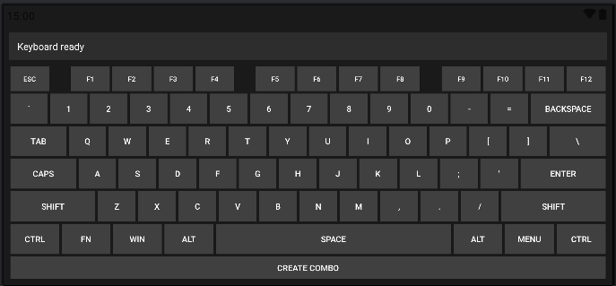
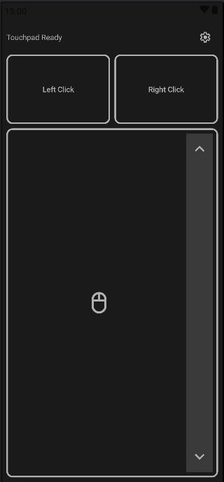
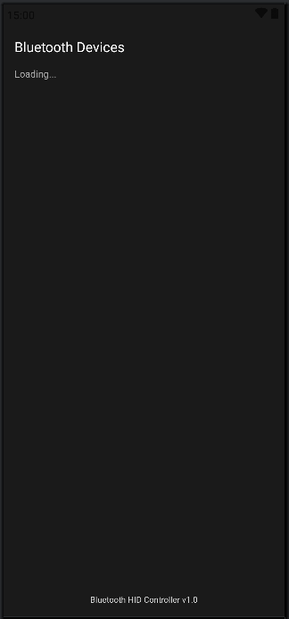

# Android Bluetooth HID Controller

Turn your Android phone into a powerful **Bluetooth HID Keyboard & Touchpad**.

This project implements a fully functional Bluetooth HID (Human Interface Device) controller that works with Windows, macOS, Linux, and other Android devices without any server-side software.

  

## 📥 Download App

[**⬇️ Download Latest APK (v1.0)**](https://github.com/yourusername/android-hid-controller/releases/latest)

*Compatible with Android 9 and newer.*

---

## 🌟 Key Features

### ⌨️ Full QWERTY Keyboard
- **Fast Typing Support:** Optimized queuing system handles high-speed input (100+ WPM).
- **Modifier Keys:** Support for Shift, Ctrl, Alt, GUI (Win/Cmd) combos.
- **Visual Feedback:** Responsive UI with key press states.

### 🖱️ Multi-Touch Trackpad
- **Smooth Cursor Control:** Sub-pixel precision for mouse movement.
- **Gestures:**
  - **Tap to Click:** Single tap for left click.
  - **Drag & Drop:** Tap-and-hold to drag windows or files.
  - **Two-Finger Scroll:** Dedicated scroll strip for smooth vertical scrolling.
- **Sensitivity Control:** Adjustable speed settings for cursor and scroll.

### ⚡ Performance
- **Zero Latency:** Dedicated background thread for HID reports ensures no UI lag.
- **Battery Efficient:** Optimized service lifecycle management.

---

## 📱 Screenshots

| Keyboard | Touchpad | Connection |
|:---:|:---:|:---:|
|  |  |  |

---

## 🛠️ Installation (For Developers)

1. **Clone the Repository**
   ```bash
   git clone https://github.com/yourusername/android-hid-controller.git
   ```

2. **Open in Android Studio**
   - File -> Open -> Select the cloned folder.
   - Wait for Gradle sync to complete.

3. **Build & Run**
   - Connect your Android device (must support Bluetooth HID Profile, Android 9+ recommended).
   - Click **Run**.

### Permissions Note
This app requires `BLUETOOTH_CONNECT` and `BLUETOOTH_SCAN` permissions. On first launch, please grant these permissions to allow device discovery.

---

## 🚀 How to Use

1. **Pairing:**
   - Go to your host computer's Bluetooth settings and start scanning.
   - Open the app on your phone and tap **"Connect New Device"**.
   - Make your phone discoverable if needed.
   - Select your computer from the list to pair.

2. **Connecting:**
   - Once paired, tap the device name in the app to establish the HID connection.

3. **Input Modes:**
   - **Keyboard Mode:** Standard QWERTY layout. Use `Shift` for caps/symbols.
   - **Touchpad Mode:** 
     - Move finger to move cursor.
     - Tap to click.
     - Drag finger on the right edge strip to scroll.
     - Use bottom buttons for Left/Right click and Scroll.

---

## 🔮 Future Ideas

- [ ] **Macro Support:** Record and replay key sequences.
- [ ] **Custom Layouts:** Gamepad mode, Numpad-only mode, or media controller.
- [ ] **Themes:** Dark/Light mode and custom key colors.
- [ ] **Voice Input:** Type using speech-to-text.
- [ ] **Clipboard Sync:** Send text from phone clipboard to PC.

---

## 📄 License

This project is licensed under the MIT License - see the [LICENSE](LICENSE) file for details.